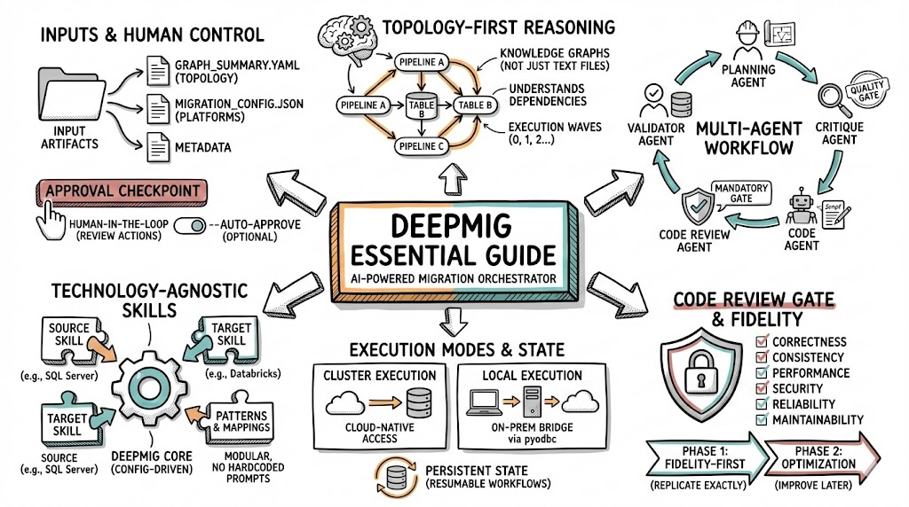

# DeepMig

**AI-Powered Migration Orchestrator** for legacy ETL systems to modern cloud data platforms.



## What is DeepMig?

DeepMig migrates enterprise data pipelines from legacy systems (SSIS, Informatica, SAS, DataStage) to modern platforms (Databricks, Snowflake, Fabric) using AI agents that reason over knowledge graphs rather than parsing text files.

## Key Concepts

| Concept | Description |
|---------|-------------|
| **Topology-First Reasoning** | Operates on structured knowledge graphs capturing dependencies and data lineage, not raw code files |
| **Multi-Agent Workflow** | Specialized agents for planning, critique, code generation, code review, and validation |
| **Technology-Agnostic Skills** | Config-driven platform support via pluggable skills for any source/target combination |
| **Code Review Gate** | Mandatory 6-dimension review (correctness, consistency, performance, security, reliability, maintainability) before execution |
| **Fidelity-First** | Phase 1 replicates source behavior exactly; optimization deferred to Phase 2 |
| **Dual Execution Modes** | Cluster execution for cloud-native access, local execution for on-prem sources via pyodbc |
| **Persistent State** | Resumable workflows with session state management |

## Quick Start

```bash
# Install
git clone https://github.com/ai4data/deepmig.git
cd deepmig
pip install -e .

# Configure LLM (Azure OpenAI, OpenAI, or Anthropic)
cp .env.example .env
# Edit .env with your API credentials

# Initialize a migration project
deepmig init --agent my-migration --source sql_server --target databricks

# Run migration
deepmig --agent my-migration
```

## Input Artifacts

DeepMig requires three inputs in `/memories/input/`:

| File | Purpose |
|------|---------|
| `config/migration_config.json` | Source/target platforms, credentials, connection details |
| `metadata/*.json` | Schema definitions, row counts, data profiling |
| `graph/graph_summary.yaml` | Knowledge graph with execution order, dependencies, transformations |

## Workflow

```
Planning Agent → Critique Agent → Code Agent → Code Review Agent → Execution → Validator Agent
                      ↑                              │
                      └──────── NEEDS_FIX ───────────┘
```

## Supported Platforms

**Sources**: SQL Server, SSIS, Informatica PowerCenter (extensible to SAS, DataStage, Talend, Ab Initio)

**Targets**: Databricks, Snowflake, Microsoft Fabric (extensible via skill plugins)

## Commands

| Command | Description |
|---------|-------------|
| `deepmig --agent NAME` | Run migration with specified agent |
| `deepmig init --agent NAME` | Initialize new migration project |
| `deepmig --auto-approve` | Run without approval prompts |
| `deepmig reset --agent NAME` | Reset agent state |
| `deepmig skills list` | List available skills |

## Documentation

- [Essential Guide](docs/deepmig-essential-guide.md) - Comprehensive documentation for architects and engineers

## License

MIT
